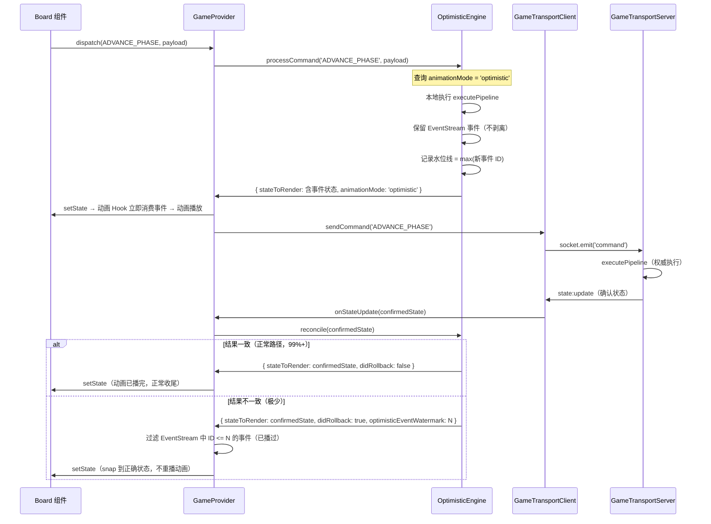
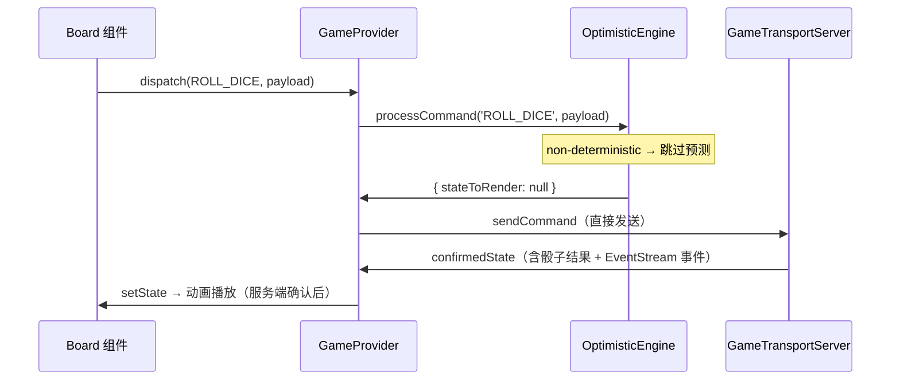

# 设计文档：乐观动画（optimistic-animation）

## 概述

本设计在现有乐观更新引擎（`OptimisticEngine`）基础上，为**确定性命令**引入乐观动画播放能力。

核心变更：修改 `stripOptimisticEventStream` 的行为，使其根据命令的 `AnimationMode` 配置决定是否保留 EventStream 事件。同时引入 **EventStream 水位线**机制，在极少数回滚场景下防止动画重复播放。

设计原则：
- **面向百游戏**：游戏层只需在 `latencyConfig` 中声明 `animationMode`，引擎层自动处理
- **向后兼容**：未配置 `animationMode` 的游戏行为与现在完全一致（`wait-confirm`）
- **最小改动**：只修改 `optimisticEngine.ts`、`types.ts`、`react.tsx` 三个文件，不新增文件

## 架构

### 整体数据流（含乐观动画）



### 非确定性命令数据流（保持不变）



## 组件与接口

### 1. 类型扩展（`types.ts`）

#### 新增类型

```typescript
/**
 * 命令级别的动画播放策略
 *
 * - 'optimistic'：乐观动画，确定性命令立即播放，不等服务端确认
 * - 'wait-confirm'：等待确认，服务端确认后播放（原有行为，默认值）
 */
export type AnimationMode = 'optimistic' | 'wait-confirm';

/**
 * 命令动画模式映射
 *
 * key 为命令类型，value 为该命令的动画播放策略。
 * 未声明的命令默认使用 'wait-confirm'。
 */
export type CommandAnimationMap = Record<string, AnimationMode>;

/**
 * EventStream 水位线
 *
 * 记录已通过乐观动画播放的最大事件 ID。
 * 回滚时用于过滤服务端确认状态中已播放的事件，防止重复播放。
 * null 表示无水位线（无乐观动画事件）。
 */
export type EventStreamWatermark = number | null;
```

#### 修改 `OptimisticConfig`

```typescript
export interface OptimisticConfig {
    enabled: boolean;
    commandDeterminism?: CommandDeterminismMap;
    /** 命令动画模式声明（可选，未声明则全部使用 'wait-confirm'） */
    animationMode?: CommandAnimationMap;
}
```

#### 修改 `ProcessCommandResult`

```typescript
export interface ProcessCommandResult {
    stateToRender: MatchState<unknown> | null;
    shouldSend: boolean;
    /** 本次命令的动画模式（供 GameProvider 决策是否需要水位线处理） */
    animationMode: AnimationMode;
}
```

#### 修改 `ReconcileResult`

```typescript
export interface ReconcileResult {
    stateToRender: MatchState<unknown>;
    didRollback: boolean;
    /**
     * 乐观动画事件水位线
     *
     * 仅当 didRollback=true 且存在乐观动画事件时有值。
     * GameProvider 用此值过滤服务端确认状态中已播放的事件。
     */
    optimisticEventWatermark: EventStreamWatermark;
}
```

### 2. OptimisticEngine 修改（`optimisticEngine.ts`）

#### 新增内部状态

```typescript
// 乐观动画事件水位线（记录已通过乐观动画播放的最大事件 ID）
let optimisticEventWatermark: EventStreamWatermark = null;
```

#### 修改 `stripOptimisticEventStream` → 重命名为 `applyAnimationMode`

原函数无条件剥离 EventStream，改为根据 `AnimationMode` 决定行为：

```typescript
/**
 * 根据动画模式决定是否保留 EventStream 事件
 *
 * - 'optimistic'：保留乐观执行产生的 EventStream 事件（立即触发动画）
 * - 'wait-confirm'：剥离 EventStream 事件（等服务端确认后触发动画）
 */
export function applyAnimationMode(
    optimisticState: MatchState<unknown>,
    previousState: MatchState<unknown>,
    mode: AnimationMode,
): MatchState<unknown> {
    if (mode === 'optimistic') {
        // 保留乐观执行产生的 EventStream 事件
        return optimisticState;
    }
    // wait-confirm：剥离 EventStream，保持原有行为
    return {
        ...optimisticState,
        sys: {
            ...optimisticState.sys,
            eventStream: previousState.sys.eventStream,
        },
    };
}
```

#### 修改 `processCommand`

```typescript
processCommand(type, payload, playerId): ProcessCommandResult {
    // ... 现有逻辑 ...

    const mode = getAnimationMode(type); // 查询配置，默认 'wait-confirm'

    const predictedState = applyAnimationMode(result.state, currentState, mode);

    // 若为 optimistic 模式，更新水位线
    if (mode === 'optimistic') {
        const newWatermark = getMaxEventId(result.state.sys.eventStream);
        if (newWatermark !== null) {
            optimisticEventWatermark = Math.max(
                optimisticEventWatermark ?? 0,
                newWatermark,
            );
        }
    }

    pendingCommands.push({ ..., predictedState, previousState: currentState });
    return { stateToRender: predictedState, shouldSend: true, animationMode: mode };
}
```

#### 修改 `reconcile`

```typescript
reconcile(serverState): ReconcileResult {
    // ... 现有调和逻辑 ...

    if (pendingCommands.length === 0) {
        // 所有命令已确认，重置水位线
        const watermark = optimisticEventWatermark;
        optimisticEventWatermark = null;
        return {
            stateToRender: serverState,
            didRollback: false,
            optimisticEventWatermark: null,
        };
    }

    // 有回滚时携带水位线
    if (didRollback) {
        const watermark = optimisticEventWatermark;
        optimisticEventWatermark = null;
        return {
            stateToRender: serverState,
            didRollback: true,
            optimisticEventWatermark: watermark,
        };
    }

    return {
        stateToRender: latestPredicted,
        didRollback: false,
        optimisticEventWatermark: null,
    };
}
```

#### 修改 `reset`

```typescript
reset(): void {
    pendingCommands = [];
    confirmedState = null;
    nextSeq = 1;
    optimisticEventWatermark = null; // 新增
}
```

### 3. GameProvider 修改（`react.tsx`）

#### `onStateUpdate` 回调中处理水位线

```typescript
onStateUpdate: (newState, players) => {
    const engine = optimisticEngineRef.current;
    let finalState: MatchState<unknown>;

    if (engine) {
        const result = engine.reconcile(newState as MatchState<unknown>);

        if (result.didRollback && result.optimisticEventWatermark !== null) {
            // 回滚：过滤已播放的乐观动画事件，防止重复播放
            finalState = filterPlayedEvents(result.stateToRender, result.optimisticEventWatermark);
        } else {
            finalState = result.stateToRender;
        }
    } else {
        finalState = newState as MatchState<unknown>;
    }

    const refreshedState = refreshInteractionOptions(finalState);
    setState(refreshedState);
    setMatchPlayers(players);
},
```

#### 新增 `filterPlayedEvents` 工具函数

```typescript
/**
 * 过滤已通过乐观动画播放的 EventStream 事件
 *
 * 从 entries 数组中移除 id <= watermark 的事件，
 * 使 useEventStreamCursor 在首次挂载时跳过这些已播放的事件
 * （首次挂载会把游标推进到当前最大 id，过滤后的事件不会被消费）。
 */
export function filterPlayedEvents(
    state: MatchState<unknown>,
    watermark: EventStreamWatermark,
): MatchState<unknown> {
    if (watermark === null) return state;
    const { entries } = state.sys.eventStream;
    if (entries.length === 0) return state;

    const filtered = entries.filter((e: { id: number }) => e.id > watermark);
    if (filtered.length === entries.length) return state; // 无变化，结构共享

    return {
        ...state,
        sys: {
            ...state.sys,
            eventStream: {
                ...state.sys.eventStream,
                entries: filtered,
            },
        },
    };
}
```

### 4. 游戏层配置扩展（`diceThroneLatencyConfig.ts`）

```typescript
export const diceThroneLatencyConfig: LatencyOptimizationConfig = {
    optimistic: {
        enabled: true,
        commandDeterminism: { /* 现有配置不变 */ },
        // 新增：声明哪些命令使用乐观动画
        animationMode: {
            'ADVANCE_PHASE': 'optimistic',
            'TOGGLE_DIE_LOCK': 'optimistic',
            'CONFIRM_ROLL': 'optimistic',
            'SELECT_ABILITY': 'optimistic',
            'RESPONSE_PASS': 'optimistic',
            // 其他命令默认 'wait-confirm'
        },
    },
    // batching/localInteraction 配置不变
};
```

## 数据模型

### EventStream 结构（现有）

EventStreamSystem 的 `eventStream` 字段结构（参考 `src/engine/systems/` 现有实现）：

```typescript
interface EventStreamState {
    entries: EventStreamEntry[];
    // 每个 entry 有唯一递增的 id
}

interface EventStreamEntry {
    id: number;       // 单调递增，用于水位线比较
    event: GameEvent;
    timestamp: number;
}
```

### 水位线计算

```typescript
/**
 * 获取 EventStream 中最大事件 ID
 *
 * 用于计算乐观动画水位线。
 * 若 EventStream 为空，返回 null。
 */
function getMaxEventId(eventStream: EventStreamState): number | null {
    if (eventStream.entries.length === 0) return null;
    return Math.max(...eventStream.entries.map(e => e.id));
}
```

**实现说明**：`EventStreamSystem` 不暴露 `lastConsumedId` 字段，因此 `filterPlayedEvents` 采用**过滤 entries 数组**的方式：移除 `id <= watermark` 的事件。

`useEventStreamCursor` 首次挂载时会把游标推进到当前 entries 的最大 id，因此过滤后剩余的事件（id > watermark）会被正常消费，已过滤的事件不会重复播放。这与"推进消费指针"语义等价，且无需修改 EventStreamSystem。

## 正确性属性

*属性是在系统所有有效执行中都应成立的特征或行为——本质上是关于系统应该做什么的形式化陈述。属性是人类可读规范与机器可验证正确性保证之间的桥梁。*

### Property A：optimistic 命令保留 EventStream 事件

*对任意* 被声明为 `deterministic` 且 `animationMode='optimistic'` 的命令，乐观执行后 `processCommand` 返回的 `stateToRender` 中 EventStream 的事件数量应大于等于执行前的数量（即新事件被保留）。

**Validates: Requirements 1.4, 2.1**

### Property B：wait-confirm 命令剥离 EventStream 事件

*对任意* 被声明为 `animationMode='wait-confirm'`（或未声明）的命令，乐观执行后 `processCommand` 返回的 `stateToRender` 中 EventStream 应与执行前的 EventStream 完全相同（事件被剥离）。

**Validates: Requirements 1.5, 2.4, 4.1**

### Property C：未声明命令默认 wait-confirm

*对任意* 未在 `CommandAnimationMap` 中声明的命令类型，`processCommand` 返回的 `animationMode` 应为 `'wait-confirm'`，且 `stateToRender` 中 EventStream 与执行前相同。

**Validates: Requirements 1.2, 4.2, 5.2**

### Property D：无回滚时 EventStream 原样传递

*对任意* 服务端确认状态，当 `reconcile` 返回 `didRollback=false` 时，`stateToRender` 中的 EventStream 应与传入的 `confirmedState` 中的 EventStream 完全相同（不做任何过滤）。

**Validates: Requirements 3.4, 4.3**

### Property E：processCommand 返回正确的 animationMode

*对任意* 命令类型，`processCommand` 返回的 `animationMode` 应与 `CommandAnimationMap` 中声明的值一致；若未声明则为 `'wait-confirm'`。

**Validates: Requirements 2.3**

### Property F：水位线等于乐观事件最大 ID

*对任意* 执行了 `animationMode='optimistic'` 命令后，`reconcile` 返回的 `optimisticEventWatermark`（当 `didRollback=true` 时）应等于该命令乐观执行后 EventStream 中所有新增事件的最大 ID。

**Validates: Requirements 3.1, 3.2**

### Property G：回滚时过滤水位线以下事件

*对任意* 水位线值 W，当 `didRollback=true` 且 `optimisticEventWatermark=W` 时，`filterPlayedEvents` 处理后的状态中，EventStream 的消费指针应推进到 W，使 ID <= W 的事件不会被动画 Hook 重复消费。

**Validates: Requirements 3.3**

### Property H：链式命令水位线取最大值

*对任意* N 个连续的 `animationMode='optimistic'` 命令，执行完所有命令后的累积水位线应等于所有命令产生的 EventStream 事件中的最大 ID。

**Validates: Requirements 6.1**

### Property I：全部确认后水位线重置

*对任意* 数量的乐观命令，当所有命令均被服务端确认（pending 队列清空）后，引擎内部水位线应重置为 `null`，且后续 `reconcile` 返回的 `optimisticEventWatermark` 为 `null`。

**Validates: Requirements 6.3**

## 错误处理

### 乐观执行失败

若 `executePipeline` 在客户端执行失败（验证不通过或异常），行为与现有逻辑一致：
- 返回 `{ stateToRender: null, shouldSend: true, animationMode: 'wait-confirm' }`
- 不更新水位线
- 命令仍发送到服务端（服务端权威）

### EventStream 结构不兼容

若 `EventStreamSystem` 不暴露 `lastConsumedId` 字段，`advanceEventStreamTo` 实现时需要：
1. 查阅 `src/engine/systems/EventStreamSystem.ts` 的实际 API
2. 若无法推进消费指针，退化为过滤 `entries` 数组（移除 ID <= watermark 的事件）
3. 此退化方案在回滚场景下仍能防止重复播放，但会丢失历史事件（可接受，因为回滚极少发生）

### 水位线溢出

EventStream 事件 ID 为单调递增整数，JavaScript `number` 类型安全整数上限为 2^53-1，正常游戏场景不会溢出。

## 测试策略

### 单元测试（Vitest）

针对具体示例和边界条件：
- `processCommand` 在 `optimistic` 模式下保留 EventStream 的具体示例
- `reconcile` 在回滚场景下携带正确水位线的具体示例（Requirements 3.2, 6.2）
- `filterPlayedEvents` 过滤逻辑的边界条件（空 EventStream、水位线为 0）

### 属性测试（fast-check + Vitest）

针对上述 9 个正确性属性，每个属性运行最少 100 次随机输入：

- **Property A/B/C**：生成随机命令类型和 `CommandAnimationMap` 配置，验证 EventStream 保留/剥离行为
- **Property D/E**：生成随机确认状态，验证无回滚路径的 EventStream 透传
- **Property F/G**：生成随机 EventStream 事件序列，验证水位线计算和过滤正确性
- **Property H/I**：生成随机数量（1-10）的连续乐观命令，验证链式水位线累积和重置

测试文件位置：`src/engine/transport/latency/__tests__/optimisticAnimation.test.ts`

每个属性测试注释格式：
```typescript
// Feature: optimistic-animation, Property A: optimistic 命令保留 EventStream 事件
```

**属性测试配置**：使用 `fc.assert(fc.property(...), { numRuns: 100 })`
