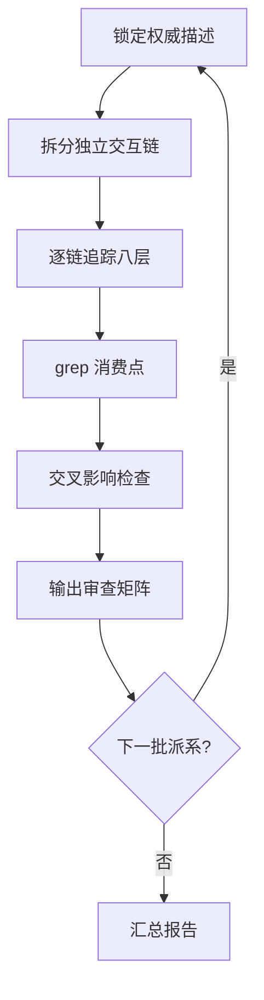

# 设计文档：大杀四方全面语义与实现完整性审查

## 概述

本审查是一个系统性的代码审计任务，不涉及新功能开发。目标是对 SmashUp 游戏所有 16 个派系和全部基地中的多步骤/复杂能力，按照「描述→实现全链路审查规范」逐条验证代码实现与规则描述的一致性。

审查采用分批执行策略，每批覆盖 2-3 个派系，输出审查矩阵。最终汇总所有发现的问题并按严重程度分类。

## 架构

### 审查流程架构



### 审查批次划分

| 批次 | 派系/基地 | 预估交互链数 |
|------|-----------|-------------|
| 批次 1 | 外星人 + 恐龙 + 海盗 | ~30 |
| 批次 2 | 忍者 + 机器人 + 巫师 | ~28 |
| 批次 3 | 僵尸 + 捣蛋鬼 | ~20 |
| 批次 4 | 幽灵 + 熊骑兵 | ~20 |
| 批次 5 | 蒸汽朋克 + 食人花 | ~22 |
| 批次 6 | 克苏鲁仆从 + 远古物种 | ~22 |
| 批次 7 | 印斯茅斯 + 米斯卡塔尼克 | ~18 |
| 批次 8 | 基础版基地 + 克苏鲁扩展基地 | ~20 |
| 批次 9 | PP/AL9000 扩展基地 + 交叉影响 | ~18 |
| 批次 10 | 汇总报告 | - |

## 组件与接口

### 审查输入源

| 来源 | 路径 | 用途 |
|------|------|------|
| 规则文档 | `src/games/smashup/rule/大杀四方规则.md` | 通用规则权威来源 |
| i18n 描述 | `public/locales/zh-CN/game-smashup.json` | 卡牌效果描述（effectText/abilityText） |
| 能力实现 | `src/games/smashup/abilities/*.ts` | 各派系能力执行函数 |
| 能力注册表 | `src/games/smashup/domain/abilityRegistry.ts` | defId→tag→executor 映射 |
| 持续效果 | `src/games/smashup/domain/ongoingEffects.ts` | 保护/限制/触发/拦截注册 |
| 持续修正 | `src/games/smashup/domain/ongoingModifiers.ts` | 力量/临界点修正注册 |
| 基地能力 | `src/games/smashup/domain/baseAbilities.ts` | 基地能力注册 |
| 扩展基地能力 | `src/games/smashup/domain/baseAbilities_expansion.ts` | 扩展基地能力注册 |
| 交互处理 | `src/games/smashup/domain/abilityInteractionHandlers.ts` | 交互回调注册 |
| 归约器 | `src/games/smashup/domain/reduce.ts` / `reducer.ts` | 事件→状态变更 |
| 测试文件 | `src/games/smashup/__tests__/*.test.ts` | 已有测试覆盖 |
| 派系数据 | `src/games/smashup/data/factions/*.ts` | 卡牌定义数据 |

### 八层审查检查点

每条独立交互链需要追踪以下八层：

1. **定义层**：效果在 `data/factions/*.ts` 的卡牌定义中声明，字段值与权威描述一致
2. **注册层**：能力已注册到 `abilityRegistry`（onPlay/talent/special/onDestroy），持续效果已注册到 `ongoingEffects`/`ongoingModifiers`，交互处理已注册到 `abilityInteractionHandlers`
3. **执行层**：`abilities/*.ts` 中的执行函数语义与描述一致，限定条件全程约束
4. **状态层**：事件被 `reduce.ts`/`reducer.ts` 正确持久化到 `SmashUpCore`
5. **验证层**：影响其他命令合法性的限制在 `commands.ts` 验证逻辑中体现
6. **UI 层**：`ui/PromptOverlay.tsx` 等 UI 组件正确展示交互选项
7. **i18n 层**：`public/locales/zh-CN/game-smashup.json` 和 `en/game-smashup.json` 中有对应条目
8. **测试层**：`__tests__/*.test.ts` 中有覆盖"触发→生效→状态正确"的测试

## 数据模型

### 审查矩阵数据结构

每条审查记录包含：

```
交互链 ID: {派系}_{卡牌}_{效果序号}
权威描述: 来自 i18n 的 effectText/abilityText 原文
八层状态:
  定义层: ✅/❌ + 证据（文件名+行号）
  注册层: ✅/❌ + 证据
  执行层: ✅/❌ + 证据
  状态层: ✅/❌ + 证据
  验证层: ✅/❌/N/A + 证据
  UI 层: ✅/❌/N/A + 证据
  i18n 层: ✅/❌ + 证据
  测试层: ✅/❌ + 证据
严重程度: ❌缺失实现 / ⚠️语义偏差 / 📝测试缺失 / ✅通过
修复建议: 具体修复方案（仅 ❌/⚠️ 时填写）
```

### 汇总报告数据结构

```
派系审查摘要:
  派系名: {name}
  总交互链数: {total}
  通过数: {passed}
  通过率: {rate}%
  问题列表:
    - 交互链 ID + 严重程度 + 简述

全局问题统计:
  ❌ 缺失实现: {count}
  ⚠️ 语义偏差: {count}
  📝 测试缺失: {count}
  审计反模式违规: {count}
```


## 正确性属性

*属性是一种在系统所有有效执行中都应成立的特征或行为——本质上是关于系统应该做什么的形式化陈述。属性作为人类可读规范和机器可验证正确性保证之间的桥梁。*

本 spec 是一个纯审计任务，所有验收标准都是审查流程要求（对比描述与实现、输出审查矩阵），产出是文档而非可执行代码。因此没有可用属性测试验证的软件行为。

审查过程中如果发现需要修复的问题，修复代码的正确性属性将在对应的修复 spec 中定义。

## 错误处理

### 审查过程中的异常情况

| 情况 | 处理方式 |
|------|---------|
| 权威描述模糊或矛盾 | 标注为"需确认"，不做假设，在汇总报告中列出 |
| 代码实现存在但无法确定语义是否正确 | 标注为"⚠️ 待验证"，附带具体疑点 |
| 测试存在但只断言事件发射不验证状态 | 标注为"📝 测试不充分"（审计反模式 #4） |
| 发现限定条件仅入口检查 | 标注为"⚠️ 语义偏差"（审计反模式 #9） |
| 发现可选效果自动执行 | 标注为"⚠️ 语义偏差"（审计反模式 #1） |
| 能力文件过大无法一次读取 | 分段读取，使用 AST 签名定位后精确读取 |

## 测试策略

### 审查验证方法

本 spec 的"测试"是审查过程本身的质量保证：

1. **交叉验证**：每条交互链的八层检查结果需要相互印证（如定义层有注册但执行层无代码 = 不一致）
2. **grep 验证**：对每个 defId 执行 grep，确认消费点完整性
3. **反模式检查**：对照 `docs/ai-rules/testing-audit.md` 中的审计反模式清单逐条检查
4. **已有测试复用**：利用已有的 880 个通过测试作为基线，审查中发现的问题如果已有测试覆盖则标注测试是否正确

### 审查产出验证

- 每个派系的审查矩阵必须覆盖该派系所有多步骤能力
- 汇总报告的统计数据必须与各派系矩阵一致
- 所有 ❌/⚠️ 标注必须附带具体证据（文件名+函数名/行号）
