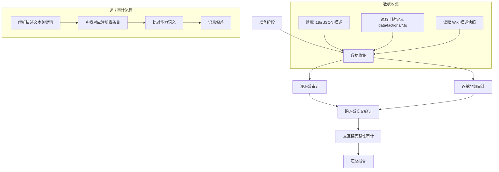
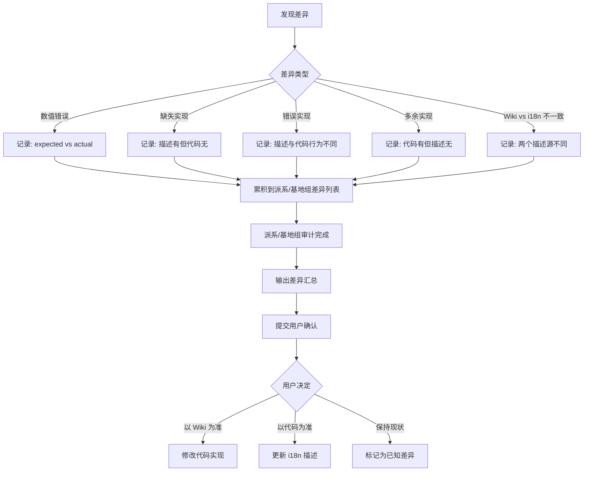

# 设计文档：大杀四方（SmashUp）全派系全基地审计

## 概述

本设计文档描述对大杀四方（SmashUp, gameId: `smashup`）进行系统性全派系、全基地"描述→实现"一致性审计的技术方案。审计覆盖全部 21 个派系（含疯狂牌库）和全部 40+ 张基地卡，遵循 `docs/ai-rules/testing-audit.md` 中的审计规范。

### 核心目标

- 确保每张卡牌的规则描述文本与代码实现完全一致
- 发现并记录所有偏差（缺失实现、错误实现、多余实现、数值错误）
- 跨派系交叉验证同类型能力的实现一致性
- 验证交互链完整性（创建交互 → 注册处理函数）

### 设计决策

1. **审计以自动化测试为主、人工审查为辅**：利用已有的注册表审计框架（`abilityBehaviorAudit.test.ts`）扩展，新增逐卡逐能力的精细审计测试
2. **Wiki 对照采用离线快照**：将 Wiki 描述文本提取为本地 JSON 数据文件，避免运行时网络依赖
3. **差异累积后批量确认**：每个派系/基地组审计完成后输出差异报告，由用户确认处理方式

## 架构

### 审计流程总览



### 审计层次模型

```
┌─────────────────────────────────────────────────┐
│ Layer 1: 静态注册表覆盖审计                       │
│   - abilityRegistry 覆盖（defId::tag → executor）│
│   - ongoingEffects 覆盖（protection/restriction/ │
│     trigger/interceptor）                        │
│   - ongoingModifiers 覆盖（power/breakpoint）    │
│   - baseAbilities 覆盖（baseDefId::timing）      │
│   - interactionHandlers 覆盖（sourceId → handler）│
├─────────────────────────────────────────────────┤
│ Layer 2: 描述→实现语义审计                        │
│   - i18n 描述文本 vs 能力执行器行为               │
│   - Wiki 描述文本 vs i18n 描述文本                │
│   - 数值审计（power/breakpoint/vpAwards/count）  │
├─────────────────────────────────────────────────┤
│ Layer 3: 跨派系交叉验证                           │
│   - 同类型能力实现路径一致性                       │
│   - 事件类型使用一致性                            │
│   - ongoing 效果注册模式一致性                     │
├─────────────────────────────────────────────────┤
│ Layer 4: 交互链完整性                             │
│   - createSimpleChoice → interactionHandler 映射 │
│   - 多步交互链连续性                              │
│   - 基地能力交互处理函数注册                       │
└─────────────────────────────────────────────────┘
```


## 组件与接口

### 1. 审计数据源

#### 1.1 代码侧数据源

| 数据源 | 路径 | 内容 |
|--------|------|------|
| 卡牌定义 | `src/games/smashup/data/factions/*.ts` | CardDef（id, type, power, abilityTags, count, playConstraint 等） |
| 基地定义 | `src/games/smashup/data/cards.ts` | BaseCardDef（id, breakpoint, vpAwards, restrictions, minionPowerBonus） |
| i18n 描述 | `public/locales/zh-CN/game-smashup.json` | cards[defId].abilityText / effectText / name |
| 能力注册表 | `src/games/smashup/domain/abilityRegistry.ts` | defId::tag → AbilityExecutor |
| 持续效果注册表 | `src/games/smashup/domain/ongoingEffects.ts` | protection / restriction / trigger / interceptor |
| 力量修正注册表 | `src/games/smashup/domain/ongoingModifiers.ts` | powerModifier / breakpointModifier |
| 基地能力注册表 | `src/games/smashup/domain/baseAbilities.ts` | baseDefId::timing → BaseAbilityExecutor |
| 扩展基地能力 | `src/games/smashup/domain/baseAbilities_expansion.ts` | 扩展包基地能力注册 |
| 交互处理注册表 | `src/games/smashup/domain/abilityInteractionHandlers.ts` | sourceId → InteractionHandler |
| 持续力量修正 | `src/games/smashup/abilities/ongoing_modifiers.ts` | 各派系 ongoing 力量修正注册 |

#### 1.2 Wiki 对照数据源

Wiki 描述文本以 JSON 快照形式存储在审计测试的 fixture 数据中，结构如下：

```typescript
interface WikiCardSnapshot {
  defId: string;
  wikiName: string;        // Wiki 上的英文名
  wikiAbilityText: string; // Wiki 上的能力描述（英文原文）
  wikiPower?: number;      // 随从力量
  wikiBreakpoint?: number; // 基地临界点
  wikiVpAwards?: [number, number, number]; // 基地 VP 奖励
}
```

### 2. 审计执行器

#### 2.1 派系审计执行器

每个派系的审计流程：

```
输入：派系 ID → 获取该派系所有 CardDef
  ↓
对每张卡：
  1. 读取 i18n 描述（abilityText / effectText）
  2. 读取 Wiki 快照描述
  3. 解析描述中的能力关键词（抽牌、消灭、移动、力量修正等）
  4. 查询注册表：
     - abilityRegistry.has(defId, tag) 对每个 abilityTag
     - ongoingEffects 对 ongoing 类卡牌
     - ongoingModifiers 对力量修正类卡牌
  5. 比对描述语义与实现行为
  6. 输出审计结果行
```

#### 2.2 基地审计执行器

每组基地的审计流程：

```
输入：基地 defId 列表
  ↓
对每张基地：
  1. 读取 BaseCardDef（breakpoint, vpAwards, restrictions, minionPowerBonus）
  2. 读取 i18n 描述
  3. 读取 Wiki 快照数值
  4. 比对数值：breakpoint、vpAwards、minionPowerBonus
  5. 检查 restrictions 实现与描述一致性
  6. 检查 baseAbilities 注册（如有特殊能力）
  7. 输出审计结果行
```

#### 2.3 跨派系交叉验证器

##### 2.3.1 分组策略

交叉验证采用**双重分组**：
- **自动分组**：扫描所有能力执行器源码，按产生的事件类型自动归类（如所有产生 `MINION_DESTROYED` 事件的能力归入"消灭随从"组）
- **手动枚举补充**：对自动分组无法覆盖的语义类别（如"返回手牌"vs"消灭"都是移除随从但语义不同），通过手动维护的分类表补充

##### 2.3.2 能力类型分组与检查维度

| 能力类型 | 关键词模式 | 事件类型检查 | 注册模式检查 | 副作用检查 | 合理差异白名单 |
|----------|-----------|-------------|-------------|-----------|--------------|
| 消灭随从 | 消灭/摧毁/移除 | MINION_DESTROYED | abilityRegistry onPlay/talent | 是否触发 onDestroy、目标区域（弃牌堆） | "返回手牌"不触发 onDestroy 是合理的 |
| 抽牌 | 抽/摸牌/查看牌库顶 | CARDS_DRAWN | abilityRegistry | 来源（牌库/弃牌堆）、是否公开 | "查看牌库顶N张选1"与"直接抽1"实现路径不同是合理的 |
| 移动随从 | 移动/转移/到另一个基地 | MINION_MOVED | abilityRegistry | ongoing 效果保留/失效、是否触发 onPlay | 自愿移动 vs 强制移动的交互差异是合理的 |
| 力量修正 | +N/-N 力量/所有随从 | — | ongoingModifiers.power | 作用范围（单体/全体/条件）、过期时机 | 永久修正 vs 回合结束修正使用不同注册方式是合理的 |
| 额外出牌 | 额外打出/再打出一张 | LIMIT_MODIFIED | abilityRegistry | 计数器类型（minion/action）、限制条件 | 不同阶段的额外出牌限制不同是合理的 |
| 弃牌堆回收 | 从弃牌堆/取回/回到手牌 | CARD_RECOVERED | abilityRegistry | 筛选条件（本方/任意方、类型）、目的地 | 回收到手牌 vs 回收到场上使用不同事件是合理的 |
| 返回手牌 | 返回手牌/收回 | MINION_RETURNED | abilityRegistry | 是否触发 onDestroy、是否触发 onPlay | 返回自己手牌 vs 返回对手手牌的实现差异是合理的 |
| 打出限制 | 不能打出/限制 | — | ongoingEffects.restriction | 限制范围（类型/力量/数量） | 不同限制条件使用不同 restriction 类型是合理的 |

##### 2.3.3 一致性判定标准

```
对每个能力类型组：
  1. 收集该组所有卡牌的实现代码
  2. 提取"规范实现路径"：
     - 使用的事件类型
     - 注册表入口（abilityRegistry / ongoingEffects / ongoingModifiers）
     - 交互模式（无交互 / 单步选择 / 多步交互）
  3. 比对组内所有卡牌的实现路径：
     a. 完全一致 → ✅ 跨派系一致
     b. 差异在白名单内 → ✅ 合理差异（标注原因）
     c. 差异不在白名单内 → ⚠️ 交叉不一致（累积待确认）
  4. 输出交叉验证矩阵
```

##### 2.3.4 交叉验证输出矩阵

```
| 能力类型 | 派系A:卡牌 | 派系B:卡牌 | 事件类型 | 注册模式 | 副作用 | 一致性 | 说明 |
|----------|-----------|-----------|---------|---------|--------|--------|------|
| 消灭随从 | 忍者:暗杀 | 外星人:绑架 | 不同 | 相同 | 不同 | ⚠️ | 暗杀用DESTROYED,绑架用RETURNED |
| 抽牌 | 巫师:魔法飞弹 | 海盗:全速前进 | 相同 | 相同 | 相同 | ✅ | - |
```

#### 2.4 交互链完整性审计器

```
输入：所有能力执行器源码
  ↓
1. 扫描所有调用 createSimpleChoice / queueInteraction 的位置
2. 提取 sourceId 参数
3. 查询 interactionHandlers 注册表
4. 标记未注册的 sourceId 为 ❌ 交互链断裂
5. 对多步交互，追踪 handler 中是否创建后续交互
```

### 3. 审计输出格式

#### 3.1 派系审计矩阵

```
| 卡牌名称 | defId | 类型 | 能力标签 | 描述摘要 | 实现状态 | 偏差说明 |
|----------|-------|------|---------|---------|---------|---------|
| 外星霸主 | alien_supreme_overlord | minion | onPlay | 打出时查看对手手牌... | ✅ 一致 | - |
| 侵略者 | alien_invader | minion | onPlay | 打出时将一个随从... | ⚠️ 偏差 | Wiki: return to hand; 代码: move to base |
```

#### 3.2 基地审计矩阵

```
| 基地名称 | defId | BP | VP | 能力描述 | 数值状态 | 能力状态 | 偏差说明 |
|----------|-------|----|----|---------|---------|---------|---------|
| 家园 | base_homeworld | 20 | 4/2/1 | 额外随从≤2力量 | ✅ | ✅ | - |
```

#### 3.3 交叉验证审计文档

每完成全部派系审计后，输出独立的交叉验证审计文档（`.tmp/smashup-cross-faction-audit.md`），按能力类型分节，记录同类型能力在不同派系中的实现比对结果：

```markdown
# 大杀四方 跨派系交叉验证审计报告

## 1. 消灭随从类

### 涉及卡牌
| 派系 | 卡牌 | defId | 描述摘要 |
|------|------|-------|---------|
| 忍者 | 暗杀 | ninja_assassination | 消灭一个力量≤2的随从 |
| 外星人 | 绑架 | alien_abduction | 将一个随从返回其拥有者手牌 |
| ... | ... | ... | ... |

### 实现路径比对
| 卡牌 | 事件类型 | 注册入口 | 触发onDestroy | 目标区域 |
|------|---------|---------|--------------|---------|
| 暗杀 | MINION_DESTROYED | abilityRegistry::onPlay | ✅ 是 | 弃牌堆 |
| 绑架 | MINION_RETURNED | abilityRegistry::onPlay | ❌ 否 | 手牌 |

### 一致性判定
- ✅ 合理差异：绑架是"返回手牌"而非"消灭"，语义不同，不触发 onDestroy 是正确的
- ⚠️ 待确认：XXX 和 YYY 都是"消灭"语义但使用了不同事件类型

## 2. 抽牌类
...（同上格式）

## 3. 移动随从类
...

## 4. 力量修正类
...

## 5. 额外出牌类
...

## 6. 弃牌堆回收类
...

## 7. 返回手牌类
...

## 8. 打出限制类
...

## 汇总
- 检查能力类型: 8 类
- 涉及卡牌总数: N 张
- ✅ 跨派系一致: N 组
- ✅ 合理差异: N 组（已标注原因）
- ⚠️ 待确认不一致: N 组（需用户确认）
```

交叉验证审计文档在所有派系逐卡审计完成后生成，作为最终汇总报告的一部分。每个"⚠️ 待确认不一致"项会随派系审计的差异一起提交用户确认。

#### 3.4 汇总报告

```
总卡牌数: N
已审计数: N
├── ✅ 一致: N (xx%)
├── ⚠️ 偏差: N (xx%)
└── ❌ 缺失: N (xx%)

交叉不一致: N 处
交互链断裂: N 处
```


## 数据模型

### 审计结果数据结构

```typescript
/** 单张卡牌的审计结果 */
interface CardAuditResult {
  defId: string;
  cardName: string;
  cardType: 'minion' | 'action';
  faction: string;
  /** 能力标签列表 */
  abilityTags: AbilityTag[];

  /** i18n 描述文本 */
  i18nDescription: string;
  /** Wiki 描述文本（如有） */
  wikiDescription?: string;

  /** 审计状态 */
  status: 'consistent' | 'deviation' | 'missing';
  /** 偏差详情列表 */
  deviations: DeviationRecord[];
}

/** 偏差记录 */
interface DeviationRecord {
  type: 'missing_impl' | 'wrong_impl' | 'extra_impl' | 'value_error' | 'description_mismatch';
  /** 涉及的能力标签或字段 */
  field: string;
  /** 描述侧的值/行为 */
  expected: string;
  /** 实现侧的值/行为 */
  actual: string;
  /** 补充说明 */
  note?: string;
}

/** 基地卡审计结果 */
interface BaseAuditResult {
  defId: string;
  baseName: string;
  faction?: string;

  /** 数值审计 */
  breakpoint: { expected: number; actual: number; match: boolean };
  vpAwards: { expected: [number, number, number]; actual: [number, number, number]; match: boolean };
  minionPowerBonus?: { expected: number; actual: number; match: boolean };

  /** 能力审计 */
  abilityStatus: 'consistent' | 'deviation' | 'missing' | 'no_ability';
  deviations: DeviationRecord[];
}

/** 跨派系交叉验证结果 */
interface CrossFactionResult {
  abilityCategory: string;  // 如 'destroy_minion', 'draw_cards'
  involvedCards: { defId: string; faction: string; description: string }[];
  /** 实现路径描述 */
  implementationPaths: { defId: string; path: string }[];
  /** 是否一致 */
  consistent: boolean;
  /** 不一致说明 */
  inconsistencyNote?: string;
}

/** 交互链审计结果 */
interface InteractionChainResult {
  sourceId: string;
  defId: string;
  /** 创建交互的代码位置 */
  creationSite: string;
  /** 是否有对应 handler */
  hasHandler: boolean;
  /** 多步交互的后续步骤 */
  chainSteps?: string[];
}

/** 派系审计汇总 */
interface FactionAuditSummary {
  factionId: string;
  factionName: string;
  totalCards: number;
  consistent: number;
  deviations: number;
  missing: number;
  cardResults: CardAuditResult[];
}

/** 全局审计汇总 */
interface GlobalAuditSummary {
  totalCards: number;
  totalBases: number;
  audited: number;
  consistent: number;
  deviations: number;
  missing: number;
  crossFactionIssues: number;
  interactionChainBreaks: number;
  factionSummaries: FactionAuditSummary[];
  baseSummaries: BaseAuditResult[];
  crossFactionResults: CrossFactionResult[];
  interactionChainResults: InteractionChainResult[];
}
```

### 审计关键词→行为映射表

审计器使用以下关键词模式来识别描述中的能力语义，并与注册表实现进行比对：

```typescript
/** 描述关键词 → 预期注册表条目的映射规则 */
const KEYWORD_BEHAVIOR_MAP = {
  // 能力标签相关
  onPlay: {
    keywords: ['打出时', '当你打出这张卡时'],
    expectedRegistry: 'abilityRegistry',
    expectedTag: 'onPlay',
  },
  talent: {
    keywords: ['天赋', '才能'],
    expectedRegistry: 'abilityRegistry',
    expectedTag: 'talent',
  },
  onDestroy: {
    keywords: ['被消灭时', '被消灭后', '本随从被消灭'],
    expectedRegistry: 'abilityRegistry',
    expectedTag: 'onDestroy',
  },
  special: {
    keywords: ['特殊', '基地计分前', '基地计分后'],
    expectedRegistry: 'abilityRegistry',
    expectedTag: 'special',
  },

  // 持续效果相关
  ongoingProtection: {
    keywords: ['不能被消灭', '不可被消灭', '不受影响'],
    expectedRegistry: 'ongoingEffects.protection',
  },
  ongoingRestriction: {
    keywords: ['不能打出', '不能移动到'],
    expectedRegistry: 'ongoingEffects.restriction',
  },
  ongoingTrigger_turnStart: {
    keywords: ['回合开始时'],
    expectedRegistry: 'ongoingEffects.trigger',
    expectedTiming: 'onTurnStart',
  },
  ongoingTrigger_turnEnd: {
    keywords: ['回合结束时'],
    expectedRegistry: 'ongoingEffects.trigger',
    expectedTiming: 'onTurnEnd',
  },
  ongoingTrigger_minionPlayed: {
    keywords: ['当.*打出随从到此基地'],
    expectedRegistry: 'ongoingEffects.trigger',
    expectedTiming: 'onMinionPlayed',
  },
  ongoingTrigger_minionDestroyed: {
    keywords: ['随从被消灭后', '当.*随从被消灭'],
    expectedRegistry: 'ongoingEffects.trigger',
    expectedTiming: 'onMinionDestroyed',
  },

  // 力量修正相关
  powerModifier: {
    keywords: [/[+＋]\d+力量/, /力量[+＋]\d+/, /-\d+力量/],
    expectedRegistry: 'ongoingModifiers.power',
  },
  breakpointModifier: {
    keywords: ['临界点', '爆破点'],
    expectedRegistry: 'ongoingModifiers.breakpoint',
  },
} as const;
```


## 正确性属性

*正确性属性是在系统所有有效执行中都应成立的特征或行为——本质上是关于系统应该做什么的形式化陈述。属性是人类可读规范与机器可验证正确性保证之间的桥梁。*

### Property 1: 能力标签执行器全覆盖

*对于任意*派系中的任意卡牌，如果该卡牌声明了 abilityTags（onPlay/talent/onDestroy 等非豁免标签），则 abilityRegistry 中必须存在对应的 `defId::tag` 执行器注册。

**Validates: Requirements 1.1-1.8, 2.1-2.4, 3.1-3.4, 4.1-4.4**

### Property 2: 持续效果注册覆盖

*对于任意* ongoing 类型的行动卡（subtype === 'ongoing'），在 ongoingEffects 注册表（protection/restriction/trigger/interceptor）或 ongoingModifiers 注册表（powerModifier/breakpointModifier）中必须存在对应的效果注册（白名单豁免的除外）。

**Validates: Requirements 11.1, 11.2, 11.3**

### Property 3: 描述关键词→注册表行为一致性

*对于任意*卡牌，如果其 i18n 描述文本包含特定能力关键词（如"回合开始时抽"→ onTurnStart 触发器、"不能被消灭"→ protection 注册、"+N力量"→ powerModifier 注册），则对应的注册表中必须存在匹配的条目。

**Validates: Requirements 1.1-1.8, 2.1-2.4, 3.1-3.4, 4.1-4.4, 11.1-11.3**

### Property 4: 基地数值一致性

*对于任意*基地卡，其 BaseCardDef 中的 breakpoint 和 vpAwards 数值必须与 Wiki 参考数据一致。如果基地定义了 minionPowerBonus，该值也必须与参考数据一致。

**Validates: Requirements 5.1, 5.2, 5.5, 6.1, 7.1, 8.1, 9.1**

### Property 5: 基地能力与限制注册覆盖

*对于任意*基地卡，如果其描述文本包含特殊能力关键词，则 baseAbilities 注册表中必须存在对应的 `baseDefId::timing` 条目。如果描述包含限制条件，则 BaseCardDef.restrictions 字段必须存在且语义匹配。

**Validates: Requirements 5.3, 5.4, 6.2, 6.3, 7.2, 8.2, 9.4**

### Property 6: 交互链完整性

*对于任意*能力执行器中调用 `createSimpleChoice` 或 `queueInteraction` 时使用的 sourceId，interactionHandlers 注册表中必须存在对应的处理函数。对于多步交互，每个后续步骤的 sourceId 也必须有对应的 handler。

**Validates: Requirements 13.1, 13.2, 13.3, 13.4**

### Property 7: 跨派系同类能力实现路径一致性

*对于任意*两张属于不同派系但具有相同能力语义类别（消灭随从/抽牌/移动随从/力量修正/额外出牌/弃牌堆回收）的卡牌，它们的实现应使用相同的事件类型和注册模式。

**Validates: Requirements 12.1-12.6**

### Property 8: 持续效果过期逻辑完整性

*对于任意*具有过期条件的持续效果（描述含"直到回合结束"/"下回合开始时消灭本卡"等），ongoingEffects 触发器注册中必须包含对应的清理时机（onTurnEnd/onTurnStart）。

**Validates: Requirements 11.4**

### Property 9: 疯狂牌终局惩罚正确性

*对于任意*非负整数 N 表示玩家持有的疯狂卡数量，终局 VP 扣除值必须等于 `Math.floor(N / 2)`。

**Validates: Requirements 3.5**


## 错误处理

### 审计过程中的错误场景

| 错误场景 | 处理方式 |
|----------|---------|
| Wiki 快照数据缺失某张卡 | 标记为 `⚠️ 无Wiki数据`，仅审计 i18n→实现一致性 |
| i18n JSON 中缺少某张卡的描述 | 标记为 `❌ 缺失描述`，记录 defId |
| 卡牌定义存在但无 abilityTags 且无描述 | 标记为 `✅ 无能力卡`（如侦察兵 alien_scout） |
| 注册表查询返回 undefined | 根据上下文判断：有 abilityTag 但无注册 → `❌ 缺失实现`；无 abilityTag 但有注册 → `⚠️ 多余实现` |
| 关键词匹配产生误报 | 通过白名单机制排除已知的特殊实现模式（如通过 trigger 而非 powerModifier 实现的力量修正） |
| 跨派系比对时能力语义分类不准确 | 使用多关键词组合匹配 + 人工确认兜底 |

### 差异冲突处理流程



## 测试策略

### 测试框架选择

- **单元测试框架**: Vitest（项目已有配置）
- **属性测试框架**: fast-check（通过 Vitest 集成）
- **测试位置**: `src/games/smashup/__tests__/`

### 属性测试（Property-Based Testing）

每个正确性属性对应一个属性测试，最少运行 100 次迭代。

#### 测试配置

```typescript
import { fc } from '@fast-check/vitest';
```

#### 属性测试清单

| 属性 | 测试文件 | 生成器 | 最少迭代 |
|------|---------|--------|---------|
| Property 1: 能力标签执行器全覆盖 | `audit-ability-coverage.property.test.ts` | 从 getAllCardDefs() 中随机选取卡牌 | 100 |
| Property 2: 持续效果注册覆盖 | `audit-ongoing-coverage.property.test.ts` | 从 ongoing 行动卡中随机选取 | 100 |
| Property 3: 描述关键词→注册表一致性 | `audit-keyword-behavior.property.test.ts` | 从所有卡牌中随机选取 | 100 |
| Property 4: 基地数值一致性 | `audit-base-values.property.test.ts` | 从 getAllBaseDefs() 中随机选取 | 100 |
| Property 5: 基地能力与限制注册覆盖 | `audit-base-abilities.property.test.ts` | 从有能力的基地中随机选取 | 100 |
| Property 6: 交互链完整性 | `audit-interaction-chain.property.test.ts` | 从所有 sourceId 中随机选取 | 100 |
| Property 7: 跨派系实现路径一致性 | `audit-cross-faction.property.test.ts` | 从同类能力组中随机选取卡牌对 | 100 |
| Property 8: 持续效果过期逻辑 | `audit-ongoing-expiry.property.test.ts` | 从有过期条件的 ongoing 卡中随机选取 | 100 |
| Property 9: 疯狂牌终局惩罚 | `audit-madness-penalty.property.test.ts` | fc.nat({ max: 30 }) 生成疯狂卡数量 | 100 |

#### 属性测试标签格式

每个属性测试必须包含注释引用设计文档属性：

```typescript
// Feature: smashup-full-faction-audit, Property 1: 能力标签执行器全覆盖
```

### 单元测试

单元测试覆盖属性测试无法覆盖的具体场景：

| 测试类型 | 测试内容 | 测试文件 |
|----------|---------|---------|
| 具体卡牌行为 | 特定卡牌的能力执行结果验证 | 各派系已有测试文件 |
| 边界条件 | 空牌库抽牌、0力量随从、满手牌等 | `audit-edge-cases.test.ts` |
| 基地计分 | 特定基地的计分流程验证 | `baseScoring.test.ts`（已有） |
| Wiki vs i18n 对照 | 逐卡描述文本比对 | `audit-wiki-comparison.test.ts` |
| 审计完整性 | 确保所有派系/基地都被审计覆盖 | `audit-completeness.test.ts` |

### 已有测试资产复用

项目中已有大量审计相关测试可直接复用或扩展：

| 已有测试 | 覆盖范围 | 扩展方向 |
|----------|---------|---------|
| `abilityBehaviorAudit.test.ts` | 关键词→行为映射、ongoing 覆盖、标签覆盖 | 扩展关键词模式、增加跨派系检查 |
| `interactionCompletenessAudit.test.ts` | 交互完整性 | 增加多步交互链追踪 |
| `entity-chain-integrity.test.ts` | 实体链完整性 | 复用 |
| `baseAbilities.test.ts` | 基地能力 | 扩展数值审计 |
| `ongoingEffects.test.ts` | 持续效果 | 扩展过期逻辑审计 |
| `ongoingModifiers.test.ts` | 力量修正 | 扩展跨派系一致性 |

### 测试执行

```bash
# 运行所有审计属性测试
npx vitest run src/games/smashup/__tests__/audit-*.property.test.ts

# 运行所有审计单元测试
npx vitest run src/games/smashup/__tests__/audit-*.test.ts

# 运行特定派系审计
npx vitest run src/games/smashup/__tests__/audit-ability-coverage.property.test.ts
```

