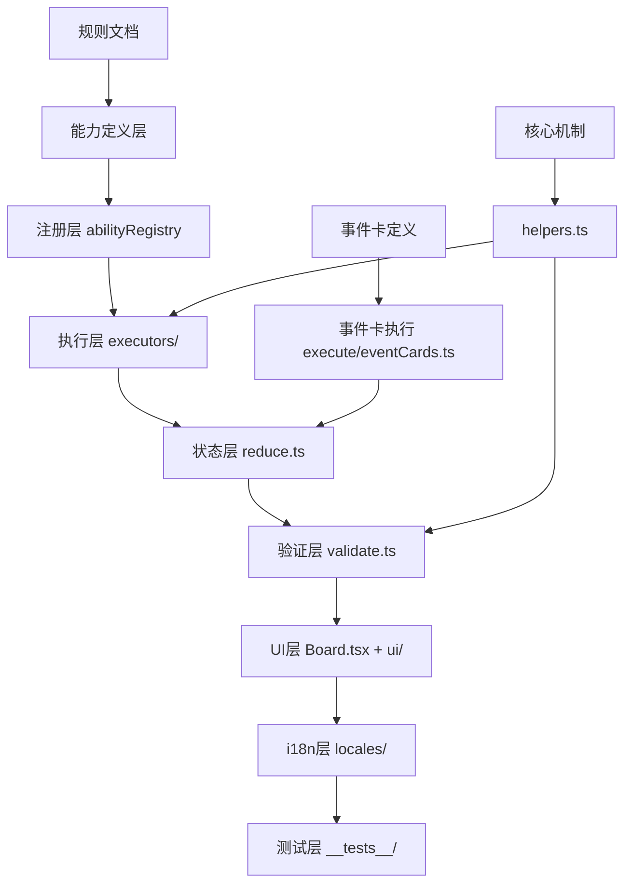

# 设计文档：召唤师战争全链路审计

## 概述

本审计对召唤师战争游戏进行全面的描述→实现全链路审查，覆盖6个阵营（堕落王国、欺心巫族、先锋军团、洞穴地精、极地矮人、炽原精灵）的所有能力（约50+个）、事件卡（24张）和核心机制。

审计方法论遵循 `docs/ai-rules/testing-audit.md`「描述→实现全链路审查规范」：

### 审查流程（六步）

**第零步：锁定权威描述** — 从规则文档（`src/games/summonerwars/rule/召唤师战争规则.md`）提取完整原文。禁止仅凭代码注释、AbilityDef.description 或 i18n 文本作为审查输入。

**第一步：拆分独立交互链** — 审查的原子单位是**独立交互链**，不是"卡牌"或"技能"。拆分信号：
- 不同的触发时机（"打出时" vs "之后每当…时"）
- 需要玩家做出新的选择（"你可以指定一个目标"）
- 独立的条件→结果对（"如果…则…"）
- **"可以/可选"语义**：描述中"你可以"/"可选"/"may" → 必须作为独立交互链，实现必须包含玩家确认 UI（确认/跳过按钮），禁止自动执行

**第一步自检（强制）**：拆分完成后，将所有交互链描述拼接，与原文逐句对照。原文每一句话都必须被至少一条链覆盖，否则拆分不完整，禁止进入第二步。

**第二步：逐链追踪八层**（见下方八层检查表）

**第三步：grep 发现所有消费点** — ID 只出现在定义+注册文件 = 消费层缺失

**第四步：交叉影响检查** — 新增的交互链是否触发已有机制的连锁反应

**第五步：数据查询一致性审查** — grep 原始字段访问（`.card.abilities`、`.card.strength`、`.card.life`），确认所有消费点走统一查询入口（`getUnitAbilities`、`calculateEffectiveStrength`、`getEffectiveLife`）。grep 范围必须包含 `.tsx` 文件。

## 架构

### 审计对象架构



### 代码结构映射

| 层级 | 文件路径 | 职责 |
|------|----------|------|
| 定义层 | `domain/abilities*.ts` | AbilityDef 数据定义 |
| 注册层 | `domain/abilities.ts` (abilityRegistry) | 技能注册到引擎层 AbilityRegistry |
| 执行层 | `domain/executors/*.ts`, `domain/execute/*.ts` | 技能和事件卡的执行逻辑 |
| 状态层 | `domain/reduce.ts` | 事件→状态变更的 reducer |
| 验证层 | `domain/validate.ts`, `domain/abilityValidation.ts` | 命令合法性验证 |
| UI层 | `ui/*.tsx`, `domain/uiHints.ts` | 交互提示、按钮、选择器 |
| i18n层 | `public/locales/*/game-summonerwars.json` | 多语言文本 |
| 测试层 | `__tests__/*.test.ts` | 单元测试和行为测试 |

## 组件与接口

### 审计输出格式

每个能力/事件卡的审计结果采用矩阵格式：

```
能力名称（ability_id）
权威描述：[规则文档原文]
原子步骤：
  1. [动词短语1] → [对应代码行为]
  2. [动词短语2] → [对应代码行为]

八层链路检查：
| 层级 | 状态 | 检查内容 |
|------|------|----------|
| 定义层 | ✅/❌ | AbilityDef 字段值与权威描述一致 |
| 注册层 | ✅/❌ | 已注册到 abilityRegistry/executorRegistry |
| 执行层 | ✅/❌ | 逻辑与描述语义一致。**限定条件全程约束检查**：描述中的限定词是否在执行路径全程被强制约束？仅在入口做前置检查但执行时不约束 = ❌ |
| 状态层 | ✅/❌ | reduce 正确持久化状态变更 |
| 验证层 | ✅/❌ | validate 放宽/收紧是否正确。**额度/权限泄漏检查**：效果给出的额度/权限，玩家能否绕过描述中的限定条件使用？ |
| UI层   | ✅/❌ | 交互提示友好、"可以/可选"效果有确认/跳过 UI、动态数值走统一查询入口 |
| i18n层 | ✅/❌ | 全部语言文件有对应条目 |
| 测试层 | ✅/❌ | 覆盖"命令→事件→状态变更"全链路（事件发射 ≠ 状态生效） |
```

### 审计分类

按风险等级分类：
- **高风险**：需要玩家交互的能力（选择目标、二选一决策、可选触发）
- **中风险**：自动触发但有复杂条件的能力（被动加成、光环效果）
- **低风险**：简单被动效果（固定数值加成、简单触发）

## 数据模型

### 审计发现分类

```typescript
interface AuditFinding {
  severity: 'critical' | 'high' | 'medium' | 'low';
  category: 'logic_error' | 'missing_implementation' | 'ui_hint_missing' | 
            'i18n_missing' | 'test_missing' | 'code_quality' | 'cross_impact';
  location: string;       // 文件路径和行号
  description: string;    // 问题描述
  ruleReference: string;  // 规则文档引用
  fix: string;            // 修复方案
}
```

### 已知问题清单（前轮审计）

| # | 严重度 | 描述 | 位置 |
|---|--------|------|------|
| 1 | low | 遗留调试日志 [rapid_fire-debug] | useGameEvents.ts:300 |
| 2 | low | 感染验证用字符串匹配而非常量 | abilities.ts infection validator |
| 3 | low | 交缠共享只读 card.abilities | getUnitAbilities in helpers.ts |
| 4 | low | 念力推拉对角线方向自动选择 | calculatePushPullPosition |


## 正确性属性

*正确性属性是一种在系统所有合法执行中都应成立的特征或行为——本质上是关于系统应该做什么的形式化陈述。属性是人类可读规范与机器可验证正确性保证之间的桥梁。*

本审计任务的性质是代码审查而非新功能开发，因此大部分验收标准通过人工代码审查（八层链路矩阵）来验证，而非通过自动化属性测试。以下列出审计过程中发现的可修复问题对应的验证属性：

Property 1: 调试日志清理验证
*For any* 代码文件在 `src/games/summonerwars/` 目录下，搜索 `rapid_fire-debug` 应返回零结果
**Validates: Requirements 9.1**

Property 2: 感染验证常量化
*For any* 疫病体判断逻辑，应使用 `domain/ids.ts` 中定义的常量或 `isUndeadCard` 等工具函数，而非字符串字面量匹配
**Validates: Requirements 9.2**

Property 3: 交缠技能共享完整性
*For any* 被交缠颂歌连接的两个单位，`getUnitAbilities(unit, state)` 返回的技能列表应包含对方的所有技能（含 tempAbilities），而非仅 card.abilities
**Validates: Requirements 9.3**

Property 4: 推拉方向确定性
*For any* 推拉操作中源单位和目标单位处于对角线位置时，`calculatePushPullPosition` 应产生确定性的、符合玩家预期的方向选择
**Validates: Requirements 9.4**

## 审计反模式清单（强制）

审查每个能力/事件卡时逐条检查，来自实际遗漏复盘：

| # | 反模式 | 正确做法 | 优先级 |
|---|--------|----------|--------|
| 1 | "可以/可选"效果自动执行 | 触发事件 → UI 确认 → 独立命令执行 | P0 |
| 2 | 测试只断言事件发射，不验证 reduce 后状态 | 同时断言事件 + 最终状态 | P0 |
| 3 | `as any` 绕过类型检查访问不存在的字段 | 用正确类型或类型守卫 | P0 |
| 4 | 审计矩阵测试层标 ✅ 但只有事件断言 | 必须覆盖"命令→事件→状态变更"全链路才能标 ✅ | P1 |
| 5 | 八层链路全 ✅ 但消费点绕过统一查询入口 | grep 原始字段访问，确认所有消费点走统一入口 | P0 |
| 6 | 只检查自身单位的技能查询，忽略对其他单位的技能查询 | `otherUnit.card.abilities` 同样需要走 `getUnitAbilities(otherUnit, state)` | P0 |
| 7 | 纵向审计通过就判定"已实现"，不做横向一致性检查 | 纵向（八层链路）+ 横向（数据查询一致性）双维度审查 | P1 |
| 8 | 描述含限定条件但实现使用不携带约束的全局机制 | 限定效果必须通过交互流程将约束固化在执行路径中 | P0 |
| 9 | UI 层直接读底层字段显示数值，绕过统一查询入口 | grep 范围必须包含 `.tsx` 文件 | P0 |

## 数据查询一致性审查

### 召唤师战争关键查询入口

| 原始字段 | 统一查询入口 | 影响 |
|----------|-------------|------|
| `unit.card.abilities` | `getUnitAbilities(unit, state)` | 交缠共享/临时技能不生效 |
| `unit.card.strength` | `calculateEffectiveStrength(unit, state)` | buff/光环加成不生效 |
| `unit.card.life` | `getEffectiveLife(unit, state)` | 生命加成不生效 |

### 审查方法

1. grep 所有 `\.card\.abilities`、`\.card\.strength`、`\.card\.life` 的直接访问
2. 排除合法场景（统一查询函数内部、attachedUnits 等不受机制影响的场景）
3. 逐个判定：该查询结果是否会因 buff/共享/临时效果而改变？是 → 必须走统一入口
4. grep 范围必须包含 `.tsx` 文件（UI 层是最常见的绕过位置）

## 错误处理

### 审计过程中的错误处理

1. **规则描述模糊**：当规则文档描述不够精确时，标记为"需确认"并向用户询问
2. **代码与规则不一致**：记录为审计发现（AuditFinding），按严重度分类
3. **缺失实现**：记录为 `missing_implementation` 类型发现，提供修复方案
4. **测试缺失**：记录为 `test_missing` 类型发现，但不在审计任务中补充测试

### 修复策略

- **critical/high**：立即修复，修复后运行相关测试确认
- **medium**：在审计任务中修复
- **low**：记录到审计报告，可在后续迭代中修复

## 测试策略

### 审计验证方式

本审计任务主要通过以下方式验证：

1. **代码审查**：逐文件逐函数审查，输出八层链路矩阵
2. **现有测试运行**：运行 `npm test -- src/games/summonerwars/` 确认849个测试全部通过
3. **修复验证**：对修复的问题运行相关测试确认不引入回归
4. **数据查询一致性 grep**：横向检查所有消费点是否走统一查询入口

### 测试覆盖判定标准

- 测试层标 ✅ 的条件：覆盖"命令→事件→状态变更"全链路（事件发射 ≠ 状态生效）
- "可以/可选"效果：正向（确认→生效）+ 负向（跳过→不生效）+ 验证（条件不满足→拒绝）
- 禁止只测注册/写入就判定"已实现"

### 单元测试

- 已有849个测试覆盖大部分能力和机制
- 审计中发现的修复需要确认现有测试仍然通过
- 如发现关键测试缺失，记录到审计报告供后续补充

### 属性测试

- 本审计任务不引入新的属性测试
- 审计发现的问题修复后通过现有测试验证
- 如发现关键测试缺失，记录到审计报告供后续补充
