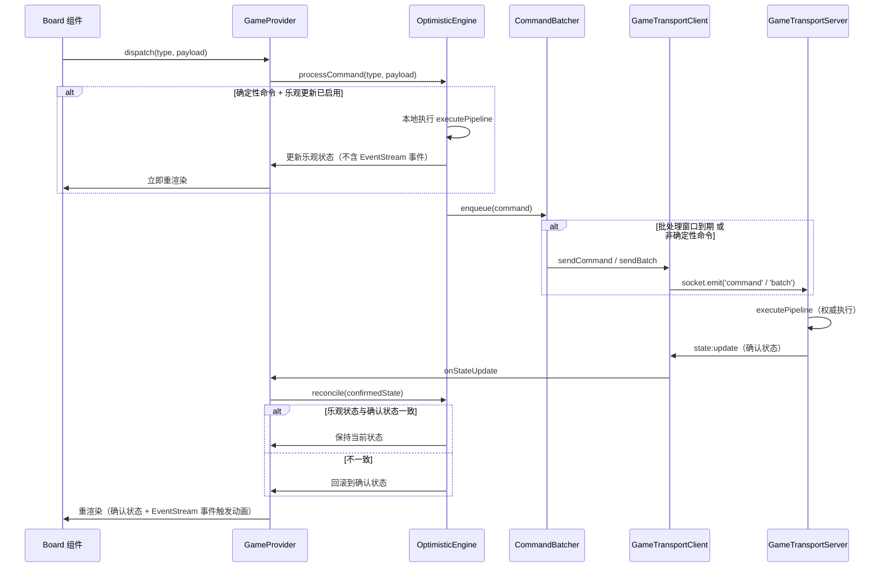
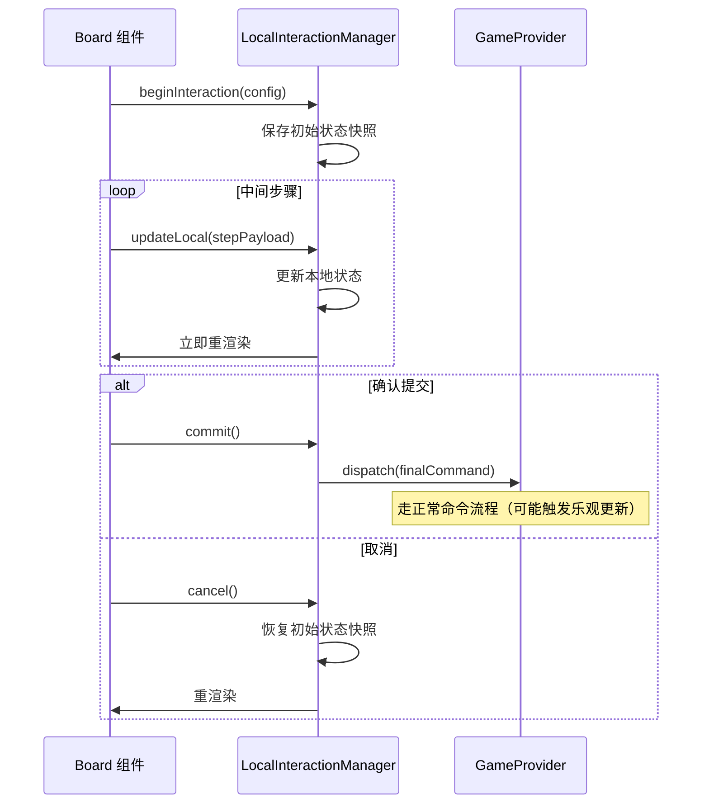

# 设计文档：传输层延迟优化

## 概述

本设计在现有传输层架构（`GameProvider` / `GameTransportClient` / `GameTransportServer`）之上，引入三个引擎层优化策略来降低在线模式的感知延迟：

1. **乐观更新（Optimistic Updates）**：客户端本地执行 Pipeline 预测状态，立即更新 UI，服务端确认后校验/回滚
2. **本地交互状态（Local Interaction State）**：多步交互在客户端本地管理，仅最终确认时发送网络命令
3. **命令批处理（Command Batching）**：时间窗口内的多个命令合并为一次网络请求

核心设计原则：
- **配置驱动**：游戏通过 Domain 配置声明启用优化策略
- **面向百游戏**：通用引擎层机制，游戏层仅需配置声明
- **服务端权威**：所有优化均为客户端感知优化，服务端始终是状态权威来源
- **动画安全**：EventStreamSystem 仅消费服务端确认状态的事件，乐观状态不触发动画

## 架构

### 整体数据流



### 本地交互状态数据流



## 组件与接口

### 1. 延迟优化配置（LatencyOptimizationConfig）

扩展 `AdapterConfig` / `GameEngineConfig`，新增延迟优化配置：

```typescript
/** 延迟优化配置 */
interface LatencyOptimizationConfig {
    /** 乐观更新配置 */
    optimistic?: {
        /** 是否启用乐观更新 */
        enabled: boolean;
        /**
         * 命令确定性声明
         * - 'deterministic'：确定性命令，可安全预测
         * - 'non-deterministic'：非确定性命令，跳过预测
         * - (state, payload) => boolean：运行时动态判断
         */
        commandDeterminism?: Record<
            string,
            'deterministic' | 'non-deterministic' | ((state: MatchState<unknown>, payload: unknown) => boolean)
        >;
    };
    /** 本地交互配置 */
    localInteraction?: {
        /** 是否启用本地交互状态管理 */
        enabled: boolean;
        /**
         * 本地交互命令声明
         * key: 最终提交的命令类型
         * value: 该交互的中间步骤命令类型列表
         */
        interactions?: Record<string, {
            /** 中间步骤命令类型 */
            localSteps: string[];
            /** 本地 reducer：处理中间步骤的状态更新 */
            localReducer: (state: unknown, stepType: string, payload: unknown) => unknown;
        }>;
    };
    /** 命令批处理配置 */
    batching?: {
        /** 是否启用命令批处理 */
        enabled: boolean;
        /** 批处理时间窗口（毫秒），默认 50ms */
        windowMs?: number;
        /** 最大批次命令数，默认 10 */
        maxBatchSize?: number;
        /** 立即发送的命令类型（不参与批处理） */
        immediateCommands?: string[];
    };
}
```

### 2. OptimisticEngine（乐观更新引擎）

核心组件，管理乐观状态预测和服务端确认校验：

```typescript
interface PendingCommand {
    /** 命令序号（单调递增） */
    seq: number;
    /** 命令类型 */
    type: string;
    /** 命令 payload */
    payload: unknown;
    /** 乐观预测后的状态 */
    predictedState: MatchState<unknown>;
    /** 预测前的状态（用于回滚） */
    previousState: MatchState<unknown>;
}

interface OptimisticEngine {
    /** 处理命令：决定是否乐观预测，返回应渲染的状态 */
    processCommand(
        type: string,
        payload: unknown,
        playerId: string,
    ): { stateToRender: MatchState<unknown> | null; shouldSend: boolean };

    /** 服务端确认状态到达时调用 */
    reconcile(confirmedState: MatchState<unknown>): {
        stateToRender: MatchState<unknown>;
        didRollback: boolean;
    };

    /** 获取当前应渲染的状态（乐观状态或确认状态） */
    getCurrentState(): MatchState<unknown> | null;

    /** 是否有未确认的乐观命令 */
    hasPendingCommands(): boolean;

    /** 重置（断线重连时调用） */
    reset(): void;
}
```

实现要点：
- 维护 `confirmedState`（最后一次服务端确认的状态）和 `pendingCommands` 队列
- `processCommand` 时：判断命令确定性 → 确定性则本地执行 Pipeline → 将命令加入 pending 队列
- `reconcile` 时：用确认状态替换 `confirmedState` → 移除已确认的命令 → 如果还有 pending 命令，基于新确认状态重新预测
- 乐观执行时，生成的状态需要**剥离 EventStream 事件**（避免动画提前触发）

### 3. CommandBatcher（命令批处理器）

```typescript
interface CommandBatcher {
    /** 入队命令 */
    enqueue(type: string, payload: unknown): void;
    /** 立即刷新队列（发送所有待发送命令） */
    flush(): void;
    /** 销毁（清理定时器） */
    destroy(): void;
}
```

实现要点：
- 使用 `setTimeout` 实现时间窗口
- `immediateCommands` 列表中的命令立即发送并触发 flush
- 非确定性命令也应立即发送（不等待批处理窗口）
- 批次发送时使用新的 socket 事件 `'batch'`

### 4. LocalInteractionManager（本地交互管理器）

```typescript
interface LocalInteractionManager<TLocalState = unknown> {
    /** 开始一个本地交互 */
    begin(interactionId: string, initialState: TLocalState): void;
    /** 更新本地交互状态（中间步骤） */
    update(stepType: string, payload: unknown): TLocalState;
    /** 提交本地交互（发送最终命令） */
    commit(): { commandType: string; payload: unknown };
    /** 取消本地交互（恢复初始状态） */
    cancel(): TLocalState;
    /** 当前是否在本地交互中 */
    isActive(): boolean;
    /** 获取当前本地状态 */
    getState(): TLocalState | null;
}
```

### 5. 协议扩展

扩展 `ClientToServerEvents` 和 `ServerToClientEvents`：

```typescript
// 客户端 → 服务端：新增批量命令事件
interface ClientToServerEvents {
    // ... 现有事件
    /** 批量命令 */
    'batch': (
        matchID: string,
        commands: Array<{ type: string; payload: unknown }>,
        credentials?: string,
    ) => void;
}

// 服务端 → 客户端：state:update 增加命令序号
interface ServerToClientEvents {
    // ... 现有事件
    /** 增量状态更新（增加 commandSeq 用于乐观更新校验） */
    'state:update': (
        matchID: string,
        state: unknown,
        matchPlayers: MatchPlayerInfo[],
        meta?: { commandSeq?: number },
    ) => void;
}
```

### 6. GameProvider 改造

`GameProvider` 组件内部集成 `OptimisticEngine`、`CommandBatcher`、`LocalInteractionManager`：

```typescript
function GameProvider({
    server, matchId, playerId, credentials, children,
    // 新增：引擎配置（乐观更新需要在客户端执行 Pipeline）
    engineConfig,
    // 新增：延迟优化配置
    latencyConfig,
    onError, onConnectionChange,
}: GameProviderProps) {
    // ... 现有逻辑

    // 初始化乐观更新引擎
    const optimisticEngine = useMemo(() => {
        if (!latencyConfig?.optimistic?.enabled || !engineConfig) return null;
        return createOptimisticEngine({
            pipelineConfig: { domain: engineConfig.domain, systems: engineConfig.systems, systemsConfig: engineConfig.systemsConfig },
            commandDeterminism: latencyConfig.optimistic.commandDeterminism ?? {},
            playerIds: [], // 从服务端同步后填充
        });
    }, [engineConfig, latencyConfig]);

    // 初始化命令批处理器
    const batcher = useMemo(() => {
        if (!latencyConfig?.batching?.enabled) return null;
        return createCommandBatcher({
            windowMs: latencyConfig.batching.windowMs ?? 50,
            maxBatchSize: latencyConfig.batching.maxBatchSize ?? 10,
            immediateCommands: latencyConfig.batching.immediateCommands ?? [],
            onFlush: (commands) => {
                if (commands.length === 1) {
                    clientRef.current?.sendCommand(commands[0].type, commands[0].payload);
                } else {
                    // 使用批量发送
                    clientRef.current?.sendBatch(commands);
                }
            },
        });
    }, [latencyConfig]);

    // 改造 dispatch
    const dispatch = useCallback((type: string, payload: unknown) => {
        // 1. 乐观更新
        if (optimisticEngine) {
            const result = optimisticEngine.processCommand(type, payload, playerId ?? '0');
            if (result.stateToRender) {
                setState(result.stateToRender);
            }
        }

        // 2. 命令批处理 或 直接发送
        if (batcher) {
            batcher.enqueue(type, payload);
        } else {
            clientRef.current?.sendCommand(type, payload);
        }
    }, [optimisticEngine, batcher, playerId]);

    // 改造 onStateUpdate 回调
    // 服务端确认状态到达时，通过 optimisticEngine.reconcile 校验
    // ...
}
```

## 数据模型

### 乐观更新状态模型

```typescript
/** 乐观引擎内部状态 */
interface OptimisticEngineState {
    /** 最后一次服务端确认的状态 */
    confirmedState: MatchState<unknown> | null;
    /** 未确认的乐观命令队列（FIFO） */
    pendingCommands: PendingCommand[];
    /** 命令序号计数器 */
    nextSeq: number;
    /** Pipeline 配置（用于本地执行） */
    pipelineConfig: PipelineConfig<unknown, Command, GameEvent>;
    /** 命令确定性声明 */
    commandDeterminism: Record<string, 'deterministic' | 'non-deterministic' | ((state: MatchState<unknown>, payload: unknown) => boolean)>;
    /** 玩家 ID 列表 */
    playerIds: string[];
    /** 本地随机数生成器（用于确定性命令的本地预测） */
    localRandom: RandomFn;
}
```

### 乐观状态 EventStream 剥离

乐观执行 Pipeline 后，需要剥离 EventStream 事件以避免动画提前触发：

```typescript
/** 从乐观状态中剥离 EventStream 事件 */
function stripOptimisticEventStream(
    optimisticState: MatchState<unknown>,
    previousState: MatchState<unknown>,
): MatchState<unknown> {
    return {
        ...optimisticState,
        sys: {
            ...optimisticState.sys,
            // 保留之前的 EventStream，不使用乐观预测产生的事件
            eventStream: previousState.sys.eventStream,
        },
    };
}
```

### 命令批处理内部状态

```typescript
interface BatcherState {
    /** 待发送命令队列 */
    queue: Array<{ type: string; payload: unknown }>;
    /** 当前批处理定时器 */
    timer: ReturnType<typeof setTimeout> | null;
    /** 配置 */
    config: {
        windowMs: number;
        maxBatchSize: number;
        immediateCommands: Set<string>;
    };
}
```

### 本地交互状态模型

```typescript
interface LocalInteractionState<TLocalState = unknown> {
    /** 交互 ID */
    interactionId: string;
    /** 交互开始时的状态快照 */
    initialSnapshot: TLocalState;
    /** 当前本地状态 */
    currentState: TLocalState;
    /** 已执行的中间步骤记录 */
    steps: Array<{ stepType: string; payload: unknown }>;
    /** 对应的最终提交命令类型 */
    commitCommandType: string;
}
```

### 服务端批量命令处理

`GameTransportServer` 新增 `handleBatch` 方法：

```typescript
/** 处理批量命令 */
private async handleBatch(
    socket: IOSocket,
    matchID: string,
    commands: Array<{ type: string; payload: unknown }>,
    credentials?: string,
): Promise<void> {
    // 验证认证
    const { match, playerID } = await this.validateCommandAuth(socket, matchID, credentials);
    if (!match || !playerID) return;

    // 串行执行每个命令
    for (const cmd of commands) {
        const success = await this.executeCommandInternal(match, playerID, cmd.type, cmd.payload);
        if (!success) {
            // 命令失败，停止执行后续命令，已执行的状态已广播
            break;
        }
    }
}
```


## 正确性属性

*正确性属性是一种在系统所有合法执行中都应成立的特征或行为——本质上是对系统应做什么的形式化陈述。属性是人类可读规格说明与机器可验证正确性保证之间的桥梁。*

### Property 1：确定性命令的乐观预测

*For any* 确定性命令和任意合法游戏状态，OptimisticEngine.processCommand 应返回非空的 stateToRender，且该状态等于在相同状态上执行 executePipeline 的结果（剥离 EventStream 后）。同时，pending 命令队列应增加一条记录。

**Validates: Requirements 1.1, 6.3**

### Property 2：非确定性命令跳过预测

*For any* 非确定性命令（包括未声明确定性的命令），OptimisticEngine.processCommand 应返回 null 的 stateToRender，不修改当前乐观状态。

**Validates: Requirements 1.4, 2.2**

### Property 3：确认状态替换乐观状态

*For any* 确认状态，当 OptimisticEngine.reconcile 被调用且无剩余 pending 命令时，返回的 stateToRender 应等于确认状态。无论之前的乐观状态是什么，最终状态始终收敛到服务端确认状态。

**Validates: Requirements 1.2, 1.3, 3.5**

### Property 4：链式乐观命令的正确调和

*For any* N 个确定性命令序列，先全部乐观执行，再逐个 reconcile 服务端确认状态，最终客户端状态应等于服务端依次执行这 N 个命令后的状态。

**Validates: Requirements 1.5, 6.4**

### Property 5：本地验证失败不更新乐观状态

*For any* 在当前状态下验证失败的命令，OptimisticEngine.processCommand 应返回 null 的 stateToRender，pending 队列长度不变。

**Validates: Requirements 1.6**

### Property 6：EventStream 始终来自确认状态

*For any* 乐观执行后的状态，其 sys.eventStream 字段应与乐观执行前的状态相同（即 EventStream 不被乐观预测修改）。reconcile 回滚时，EventStream 来自确认状态。

**Validates: Requirements 1.7, 6.2**

### Property 7：本地交互取消的往返一致性

*For any* 本地交互，执行任意数量的中间步骤后取消，LocalInteractionManager 返回的状态应与交互开始时的初始状态完全相同。

**Validates: Requirements 3.4**

### Property 8：本地交互中间步骤不产生网络命令

*For any* 本地交互的中间步骤，LocalInteractionManager.update 不应触发任何网络命令发送。

**Validates: Requirements 3.2**

### Property 9：本地交互提交产生单一命令

*For any* 已完成的本地交互（经过任意数量的中间步骤），LocalInteractionManager.commit 应恰好产生一个命令。

**Validates: Requirements 3.3**

### Property 10：批处理时间窗口内的命令合并

*For any* 在批处理时间窗口内入队的 N 个命令（N ≤ maxBatchSize），CommandBatcher 应将它们合并为一个批次发送。

**Validates: Requirements 4.2**

### Property 11：服务端批量执行等价性

*For any* 命令批次，服务端按序执行批次中所有命令后的最终状态，应等于逐条发送这些命令后的最终状态。

**Validates: Requirements 4.3**

### Property 12：服务端批量部分失败

*For any* 包含 N 个命令的批次，若第 K 个命令执行失败（1 ≤ K ≤ N），则最终状态应等于成功执行前 K-1 个命令后的状态，且第 K+1 到第 N 个命令不被执行。

**Validates: Requirements 4.4**

### Property 13：最终一致性

*For any* 命令序列，经过乐观更新和服务端确认的完整流程后，客户端状态应与服务端状态完全一致（core 和 sys 均相同）。

**Validates: Requirements 6.1**

## 错误处理

### 乐观更新错误场景

| 场景 | 处理方式 |
|------|----------|
| 本地 Pipeline 执行抛出异常 | 捕获异常，不更新乐观状态，命令仍发送到服务端 |
| 服务端返回 error 事件 | 从 pending 队列移除对应命令，回滚到上一个确认状态 |
| 乐观状态与确认状态不一致 | 自动回滚，用确认状态重新预测剩余 pending 命令 |
| 网络断开 | 保持最后确认状态，pending 队列暂停 |
| 网络重连 | 清空 pending 队列，以服务端 sync 状态为准 |

### 命令批处理错误场景

| 场景 | 处理方式 |
|------|----------|
| 批次中某命令失败 | 停止执行后续命令，广播已执行状态，返回错误 |
| 批次消息发送失败 | socket.io 自动重连后重新 sync |
| 批次超过 maxBatchSize | 立即 flush 当前批次，新命令进入下一批次 |

### 本地交互错误场景

| 场景 | 处理方式 |
|------|----------|
| 本地 reducer 抛出异常 | 自动取消交互，恢复初始状态 |
| 提交后服务端拒绝 | 通过乐观更新回滚机制处理 |
| 交互过程中收到服务端状态更新 | 如果更新与当前交互无关，正常应用；如果冲突，取消当前交互 |

## 测试策略

### 属性测试（Property-Based Testing）

使用 **fast-check** 作为属性测试库（项目已使用 Vitest，fast-check 与之集成良好）。

每个正确性属性对应一个属性测试，最少运行 100 次迭代。测试标注格式：

```typescript
// Feature: transport-latency-optimization, Property 1: 确定性命令的乐观预测
```

**生成器设计**：
- `arbCommand(deterministic: boolean)`：生成随机命令（确定性/非确定性）
- `arbMatchState()`：生成随机但合法的 MatchState
- `arbCommandSequence(n: number)`：生成 N 个命令的序列
- `arbBatchConfig()`：生成随机批处理配置
- `arbLocalInteractionSteps()`：生成随机本地交互步骤序列

**关键属性测试**：
- Property 1-6：测试 OptimisticEngine 的核心行为
- Property 7-9：测试 LocalInteractionManager 的状态管理
- Property 10-12：测试 CommandBatcher 和服务端批量执行
- Property 13：端到端一致性测试

### 单元测试

单元测试覆盖具体示例和边界条件：

- OptimisticEngine：空 pending 队列时的 reconcile、连续多次 reconcile、reset 后的状态
- CommandBatcher：windowMs=0 的退化行为、immediateCommands 的立即发送、maxBatchSize 边界
- LocalInteractionManager：空步骤的 commit、重复 begin 的处理、cancel 后再 begin
